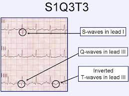
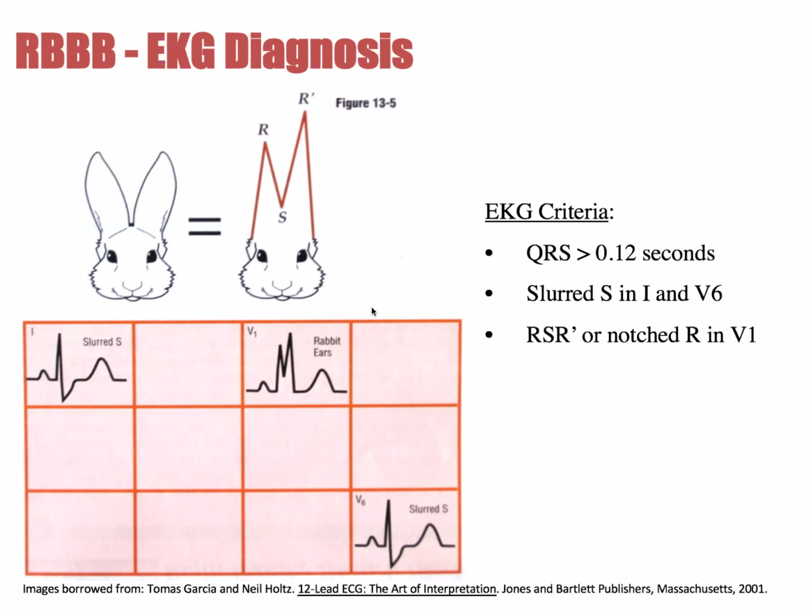

# 010 Objawy zatoru tętnicy płucnej

## Final

**Definicja:** Zamknięcie tętnicy płucnej lub jej rozgałęzień przez materiał zatorowy. Rodzaje materiału zatorowego: skrzepliny, płyn owodniowy, powietrze, tłuszcz, tkanka nowotworowa.

**Epidemiologia:** ok 20tyś/rok w PL

**Obraz kliniczny:** 

1. Podmiotowo:
   1. 80% duszność
   2. 50% ból KLP o charakterze opłucnowym
   3. 20% kaszel
   4. 10% ból KLP o chatakterze wieńcowym
   5. Rzadziej: zasłabnięcie, omdlenie, krwioplucie
2. Przedmiotowo:
   1. Tachykardia
   2. Tachypnoe
   3. Poszerzenie żył szyjnych
   4. Zgłośnienie składowej płucnej tonu 2
   5. (czasami) szmer niedomykalności zastawki trójdzielnej
   6. Hipotensja, wstrząs
3. U 1/3 objawy DVT

**Diagnostyka:** 

- Najważniejsze: AngioTK — potwierdzenie zatoru
- DDimery — służą wykluczaniu
- Troponiny, NT-proBNP mogą być dodatnie
- RTG: powiększenie sylwetki serca, zagęszczenia miąższowe
- ECHO: cechy przeciążenia prawej komory
- EKG: 44% tachykardia zatokowa. RBBB, prawogram, s1q3t3
- 
- 

**Algorytm:** 

1. Oceniamy ryzyko wczesnego zgonu. Jeżeli jest wstrząs, hipotensja lub zatrzymanie krążenia, to oznacza, że ryzyko wczesnego zgonu jest wysokie. => zakładamy, że prawdopodobieństwo jest duże => podajemy HNF, wykonujemy AngioTK (zator) i ECHO (przeciążenie pk) => jeśli potwierdzona ZP, to rozpoznajemy ZP wysokiego ryzyka i nie wykonujemy oceny PESI => (L) tromboliza + HNF, potem VKA. Jeśli tromboliza nieskuteczna to wykonujemy embolektomię.
2. Jeśli ryzyko wczesnego zgonu w ocenie pierwotnej nie jest wysokie, to oceniamy prawdopodobieństgwo kliniczne w skali Genewskiej lub skali Wellsa dla ZP. 
3. Jeśli prawdopodobieństwo jest duże lub pośrednie to podajemy HNF. 
4. Jeśli prawdopodobieństwo jest duże to od razu wykonujemy AngioTK.
5. Jeśli prawdopodobieństwo jest pośrednie lub niskie to najpierw badamy D-dimery. Jeśli D-dimery są niskie, to wykluczamy DVT za pomocą CUS. Jeśli D-dimery są wysokie to wykonujemy AngioTK.
6. Jeśli AngioTK potwierdziło ZP, to wykonujemy ocenę ryzyka za pomocą skali PESI/sPESI. 
   1. Jeśli 0 punktów, to rozpoznajemy ZP niskiego ryzyka.
   2. 1pkt + ujemne troponiny => ZP pośredniego niskiego ryzyka.
   3. 1pkt + dodatnie tropinny => ZP pośredniego wysokiego ryzyka.
7. ZP niskiego i pośredniego niskiego ryzyka leczymy przeciwkrzepliwie. ZP niskiego ryzyka możemy wcześniej wypisać do domu.
8. ZP pośredniego wysokiego ryzyka leczymy p/krzepliwie (ew rozważamy wszczepienie filtru). Monitorujemy w szpitalu. Ew rozważamy leczenie reperfuzyjne.

Dawka HNF 80j/kg

TODO:

- Znać skale Genewską, PESI, sPESI, Wellsa — brak znajomości to błąd kardynalny

## Brudnopis

Tpisania=18min