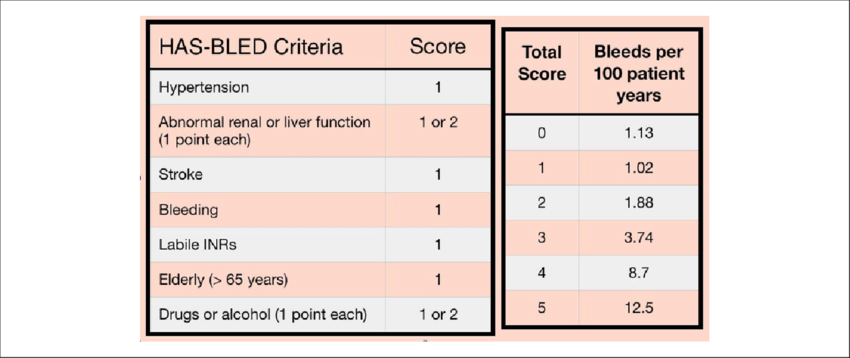

# 012 Zasady profilaktyki powikłań zatorowo-zakrzepowych u pacjenta z migotaniem przedsionków

## Final

**Definicja:** 

- Migotanie przedsionków — Szybka nieskoordynowana aktywność przedsionków z utratą efekrywności hemodynamicznej ich funkcji oraz z towarzyszącą niemiarową czynnością komór. 

**Epidemiologia:** ...TODO

**Patofizjologia:** ...TODO

**Obraz kliniczny:** 

Objawy podmiotowe:

- Kołatanie serca
- Omdlenia
- Zawroty głowy
- Napadowe poty
- Osłabienie / upośledzenie tolerancji wysiłku
- Skala EHRA — jak bardzo objawy upośledzają codzienną aktywność. I—bez objawów podmiotowych, II — łagodne=nie zakłócają codziennej aktywności, III—ciężkie=ograniczają codzienną aktywność, IV—uniemożliwiają normalne funkcjonowanie

Objawy przedmiotowe:

1. Niemiarowość zupełna (tj nie ma wzorca niemiarowości, np długi-długi-krótki) czynności serca
2. Ubytek tętna (Większa ilość skurczów przy osłuchiwaniu niż przy palpacji obwodowej, bo nie wszystkie skurcze są z prawidłowym napełnieniem)

**Przebieg:** ...TODO: napadowe, przetrwałe, przetrwałe długo trwające, utrwalone

**Diagnostyka:** ...TODO

**Rozpoznanie:** ...TODO

**Leczenie:** Kontrola rytmu komór i rytmu zatokowego w [011 Metody przywracania rytmu zatokowego u pacjentów z migotaniem przedsionków](./011%20Metody%20przywracania%20rytmu%20zatokowego%20u%20pacjentów%20z%20migotaniem%20przedsionków.md)

### Powikłania zatorowo-zakrzepowe:

Najważniejsze powikłanie: udar mózgu

**Leczenie przeciwkrzepliwe przed kardiowersją**

Kontynuujemy leczenie p/k po kardiowersji, bo wiele nawrotów AF jest bezobjawowych a ryzyko w nich również istnieje udaru.

**Leczenie przeciwkrzepliwe przewlekłe:**

## Brudnopis

