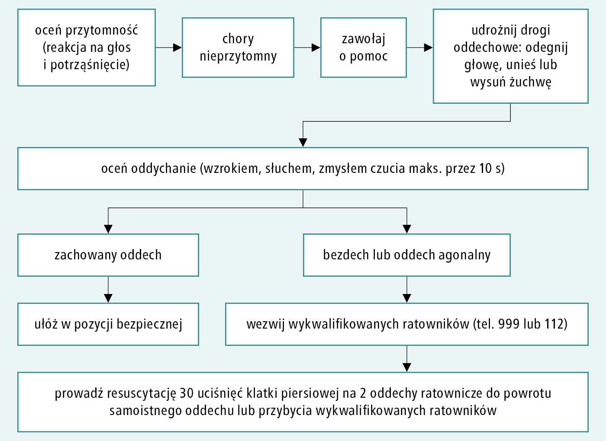
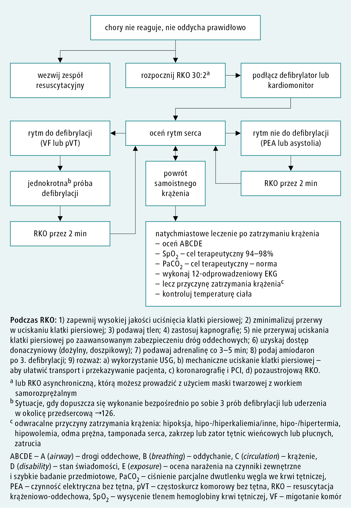

# 017 Postępowanie w nagłym zatrzymaniu krążenia

## Final

**Defibrylacja**:

- U dzieci 4J/kg
- U dorosłych wg instrukcji urządzenia. Jeśli brak to w jednofazowym 360J, a w dwufazowym 150->200->...->360J

**Farmakoterapia ALS**:

- Adrenalina **w 10 ml 0,9% NaCl** po 3 nieskutecznej defibrylacji 1mg co 3-5 minut (czyli po co drugiej)
  - W rytmach nie do defibrylacji podać jak najszybciej
- Amiodaron po 3 nieskutecznej defibrylacji 150mg **w 20 ml 5% glukozy** RAZ
  - (zamiast amiodaronu) Lidokaina po 5 nieskutecznej defibrylacji 50mg RAZ
- Po każdym wstrzyknięciu adrenaliny przepłukać cewnik 20ml 0,9% NaCl albo 
- siarczan magnezu: VF lub VT oporne na 3 wyładowania elektryczne przy podejrzeniu hipomagnezemii (nie stosuj rutynowo w opornym VF lub VT), wielokształtny VT typu torsade de pointes

**Odwracalne przyczyny NZK:**

1. Hipowolemia
2. Hipoksja
3. Hipotermia
4. Hiper K+,H+, Hipo K+, Ca2+
5. pneumoThorax
6. Tamponada
7. Toksyny
8. Thrombosis (Zatorowość, OZW)

## Brudnopis

