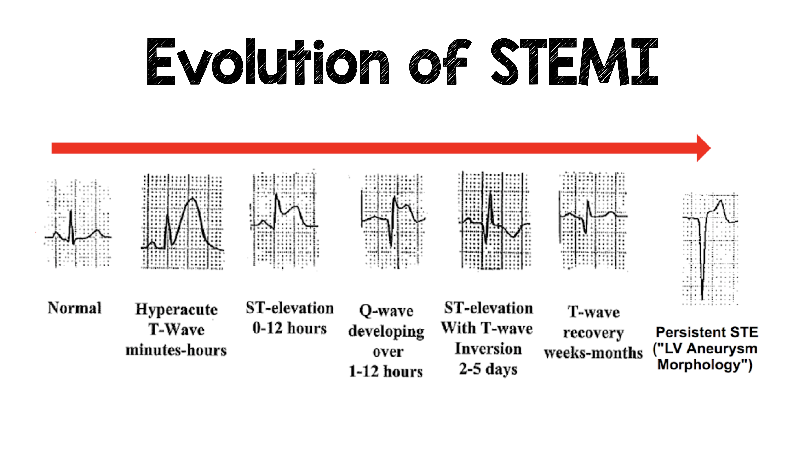

# 021 Uniwersalna definicja zawału serca

## Final

Ostry zawał = ostre uszkodzenie miokardium + ostre niedokrwienie m. sercowego

Cechy uszkodzenia miokardium:

- Wzrost cTn z  ≥ 1 wartością  powyżej 99 percentyla GGN
- Ostre: gdy wzrost lub spadek cTN ; przewlekłe: gdy utrzymują się na stałym poziomie

Cechy niedokrwienia:

- Objawy
- Nowe niedokrwienne zmiany w EKG
- Patologiczny załamek Q w EKG
- Nowy ubytek w badaniach obrazowych odpowiadający niedokrwieniu
- Wykrycie skrzepliny w tętnicy wieńcowej podczas koronarografii lub badania sekcyjnego.

... TODO: typy zawału (Kardiologia 2, slajd 50)

... TODO: kryteria przebytego zawału

**Klasyfikacja:**

Postacie kliniczne: UA, NSTEMI, STEMI ew podzial na STE-ACS i NSTE-ACS (w tym UA i NSTEMI)

STEMI = uniesienie ST (lub ST trudne do oceny) + cechy ostrego uszkodzenia miokardium

NSTE-ACS = brak uniesienia ST

NSTEMI = brak uniesienia ST + cechy ostrego uszkodzenia miokardium

UA = brak uniesienia ST i brak cech ostrego uszkodzenia miokahdium

**EKG w OZW:**

1. Lokalizacja zmian (co najmniej 2 sąsiadujące odprowadzenia)
   - V1-V4 - ściana przednia,
   - II, III, aVF - ściana dolna,
   - I, aVL, V5, V6 - ściana boczna i koniuszek,
   - Vr3, Vr4 - ściana prawej komory. 
2. UA/NSTEMI
   1. Prawidłowe EKG 50%
   2. Obniżenie (rzadko przemijające uniesienie) ST
   3. odwrócenie załamków T
      1. Prawidłowy T dodatni w: I,II,V2-V6
      2. Prawidłowy T ujemny w: aVR
   4. Ponad 1mm = 0,1mV
   5. Liczy się też odwrócenie wcześniej ujemnych na dodatnie
3. STEMI
   1. Typowa ewolucja
   2. Świeży blok RBBB/LBBB

**Typowa ewolucja STEMI:**

**LBBB:**

1. Czas trwania zespołu QRS ≥0,12 s
2. Monofazowe zespoły QRS typu zawęźlonego lub rozdwojonego załamka R w V5-V6
3. Zwykle przeciwstawny kierunek odcinków ST i załamków T względem głównego wychylenia zespołów QRS.

## Brudnopis

