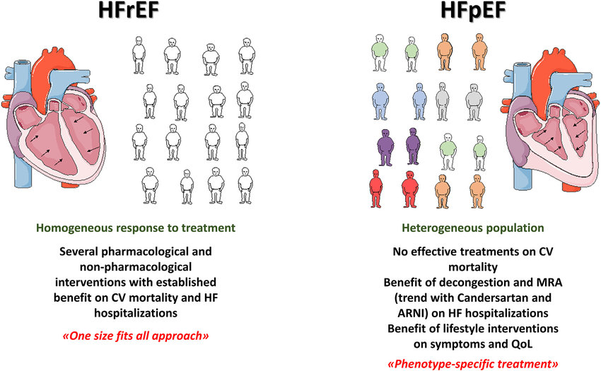
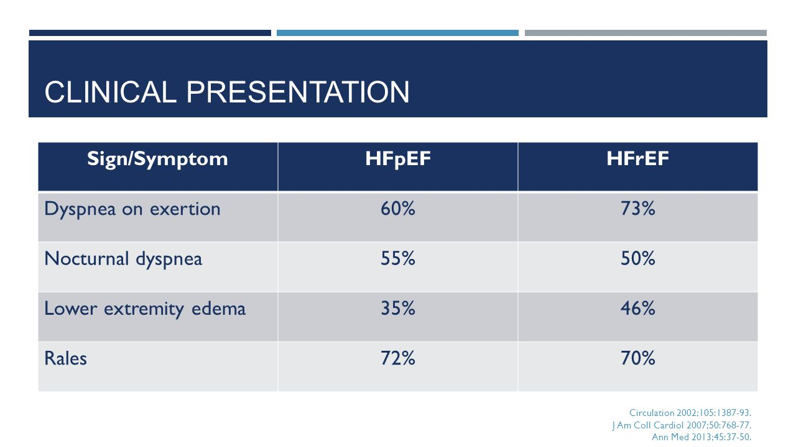
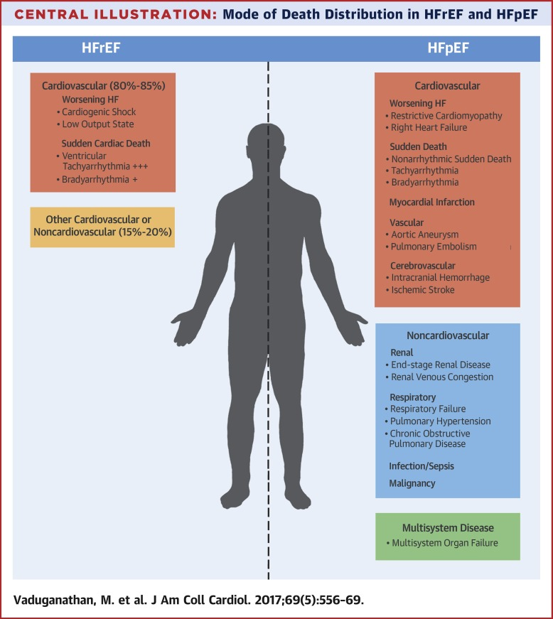
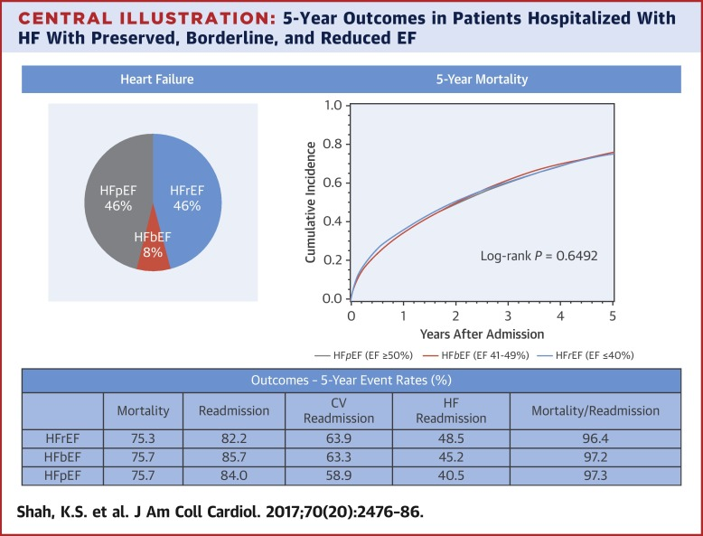
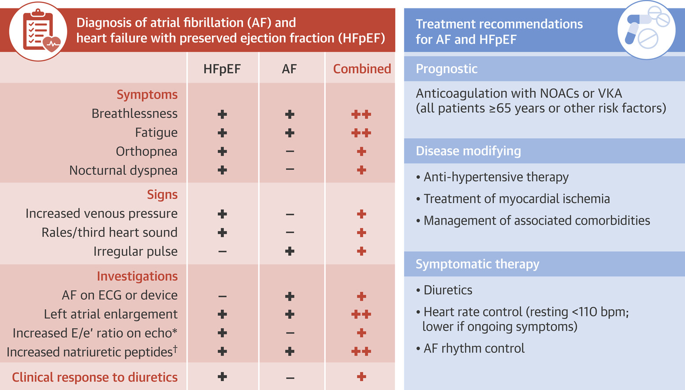

# 025 Obraz kliniczny niewydolności serca z zachowaną frakcją wyrzutową lewej komory

## Final

**Definicja NS:** Stan, w którym w wyniku zaburzenia czynności serca dochodzi do zmniejszenia pojemności minutowej serca w stosunku do zapotrzebowania metabolicznego tkanek ustroju bądź właściwa pojemność minutowa jest utrzymywana dzięki podwyższeniu ciśnienia napełniania, co powoduje objawy kliniczne.

**Przyczyny:**

**Podsumowanie leczenia:**

**Objawy:**

Zasadniczo podobne, ale raczej wynikają z zastoju żylnego (podwyższonego ciśnienia napełniania) niż ze spadku CO. Jest jeszcze mechanizm kompensacyjny, który przez podniesienie ciśń. napełniania zachowuje cardiac output.

**Na co umierają:**

**Różnicowanie z AF!:**

**NYHA**

**Z "ustny opracowanie":**

Zgodnie z dużym Szczeklikiem (str. 395-396) objawy kliniczne HFpEF są podobne do objawów przewlekłej niewydolności serca z dysfunkcją skurczową, ponieważ **w obu przypadkach następuje wzrost ciśnienia napełniania** lewej komory, skutkując objawami zastoju w krążeniu płucnym. **Zwykle nie występują wyraźne objawy hipoperfuzji obwodowej**. Objawy zastoju w krążeniu płucnym:

-Duszność (spoczynkowa lub wysiłkowa) – typowo orthopnoe (1-2min po położeniu się i ustępuje po kilku minutach od pionizacji) lub napadowa duszność nocna (pojawia się znacznie później po położeniu się niż orthopnoe, wybudza ze snu i ustępuje w czasie powyżej 30min).

-Kaszel(ekwiwalent duszności wysiłkowej lub orthopnoe) – przeważnie suchy, niekiedy z odksztuszaniem różowo podbarwionej plwociny (zwykle w obrzęku płuc).
 -Świszczący oddech.
 -Przyspieszone oddychanie

-Trzeszczenia typowo nad podstawą płuc, ale mogą sięgać ich szczytów. Mogą towarzyszyć im świsty i furczenia częściowo związane z obrzękiem błony śluzowej oskrzeli.
 Według innych źródeł dodatkowo: nietolerancja wysiłku, męczliwość, poszerzenie żył szyjnych, hepatomegalia, obrzęki, trzeci i czwarty ton serca, przesunięte uderzenie koniuszkowe. Częściej występuje u osób starszych i kobiet.

## Brudnopis

