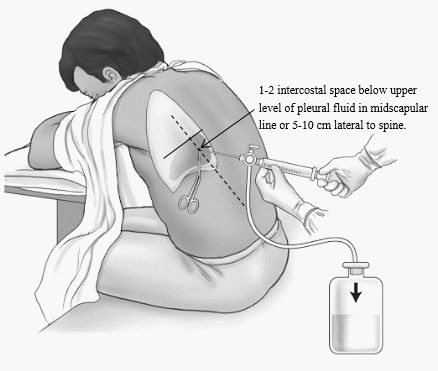

# 038 Sposób postępowania w przypadku stwierdzenia płynu w opłucnej

## Final

**Objawy:**

1. Duszność.
2. Kaszel.
3. Ból w klatce piersiowej.
4. Objawy choroby podstawowej.
5. Ruchy klatki piersiowej asymetryczne, słabsze po stronie płynu.
6. Stłumienie wypuku.
7. Osłabione drżenie głosowe.
8. Szmer pęcherzykowy nieobecny/ściszony,  przy niewielkiej ilości płynu może być słyszalne tarcie opłucnowe.

**Postępowanie**

1. Nakłucie i pobranie płynu

2. Diagnostyka rodzaju płynu

   1. Glukoza, pH, akt LDH
   2. Zastosuj kryteria Lighta w celu różnicowania wysięku i przesięku
   3. W przypadku stwierdzenia wysięku zmierz LDH, ew wykonaj posiew w celu stwierdzenia czy jest powikłany

3. Leczenie przesięku: lecz ch. podstawową

4. Leczenie wysięku nowotworowego:

   1. Mała ilość płynu, bez objawów = obserwacja.
   2. Narastający wysięk = nakłucie opłucnej, u większości nawrót (po ok. 1 tyg. do 1 miesiąca).
   3. Nawracający wysięk = drenaż jamy opłucnej przez przestrzeń międzyżebrową i doopłucnowe podanie środka obliterującego (pleurodeza) lub długotrwały drenaż za pomocą cewnika utrzymywanego w jamie opłucnej lub torakoskopia z pleurodezą z użyciem talku.

5. Leczenie wysięku w bakteryjnym zap. płuc

   1. Ab iv zgodnie z posiewem
   2. Ab empiryczna
      1. cefuroksym 1,5g 3 × dz. + metronidazol 500 mg 3 × dz.
      2. penicylina benzylowa 1,2 g 4 × dz. + cyprofloksacyna 400 mg 2 × dz.
      3. meropenem 1 g 3 × dz. + metronidazol 500 mg 3 × dz.

6. Leczenie ropniaka opłucnej

   1. Jeśli PZP: jak w wysięku w bakteryjnym zap płuc
   2. Jeśli w przebiegu zakażenia wewnątrzszpitalnego
      1. 3 antybiotyki
      2. Szerokospektralny: ceftazydym, meropenem
      3. Metronidazol 500mg
      4. antybiotyk aktywny wobec MRSA (np. wankomycyna).

7. Krwiak opłucnej

   1. Definicja: hematokryt płynu opłucnowego wynosi ≥ 50% hematokrytu krwi obwodowej

   2. Różnicować z krwistym wysiękiem, który ma Hct <50% i zwykle

      towarzyszy nowotworowi lub zawałowi płuca.

   3. Leczenie: pilny drenaż od razu!

8. Wysięk chłonny:

   1. wysięk opłucnowy utworzony przez chłonkę, która przedostaje się do jamy opłucnej z uszkodzonego przewodu piersiowego lub dużego naczynia chłonnego.
   2. Leczenie:
      1. Drenaż
      2. Dodatkowo całkowite żywienie pozajelitowe w celu zmniejszenia wytwarzania chłonki i zamknięcia przetoki między naczyniem chłonnym a jamą opłucnej.

9. Drenaż 

   1. wskazania
      1. Płyn o wyglądzie niewątpliwie ropnym lub mętny.
      2. Płyn o pH <7,2.
      3. Obecność drobnoustrojów w nieropnym płynie opłucnowym stwierdzona w preparacie bezpośrednim barwionym metodą Grama lub w posiewie.
      4. Płyn otorbiony.
      5. Krwiak opłucnej — zawsze drenaż pilny, bo powikłania (ropniak, zwłóknienie)
      6. Wysięk chłonny — wskazanie do planowego
   2. Jeśli nieskuteczny:
      1. dodatkowych badań obrazowych.
      2. Doopłucnowe podanie leku fibrynolitycznego (urokinaza, streptokinaza) rozważyć np. w przypadku wielu zbiorników otorbionego, zakażonego płynu.
      3. Jeśli płyn ponad 7 dni pomimo antybiotykoterapii i drenażu => leczenie operacyjne (wideotorakoskopia, dekortykacja)

**Torakocenteza:**

1. Miejsce:
   1. Dobrze wyczuwalne międzyżebrze; 
   2. wkłucie po górnym brzegu żebra: 
   3. duża ilość płynu wolnego – 1 lub 2 międzyżebrza poniżej górnej granicy stłumienia wypuku, 
   4. pośrodku pomiędzy kręgosłupem a linią pachową tylną (tradycyjnie) 
   5. albo na bocznej powierzchni klatki piersiowej (zalecane z uwagi na najmniejsze ryzyko uszkodzenia pęczka naczyniowo-nerwowego); 
   6. mała ilość płynu wolnego lub płyn otorbiony – pod kontrolą USG

**Drenaż opłucnej:**

1. Miejsce: 
   1. Odma opłucnowa: V–VIII przestrzeń międzyżebrowa w linii **pachowej środkowej**, rzadziej II przestrzeń międzyżebrowa w linii środkowoobojczykowej.
   2. Nieotorbiony płyn: V–VIII przestrzeń międzyżebrowa w linii pachowej środkowej.

   3. Ograniczony zbiornik powietrza lub płynu: stosownie od jego umiejscowienia ustalonego za pomocą badań obrazowych.

## Brudnopis

