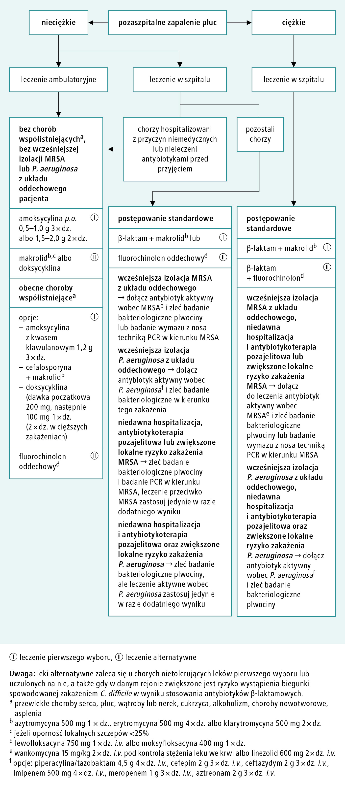

# 048 Obraz kliniczny i leczenie pozaszpitalnego zapalenia płuc

## Final

**Definicja:** Objawy ostrego zakażenia DDO + zacienienie w RTG KLP, którego nie można wytłumaczyć w inny sposób (np obrzękiem płuc)

Nie można rozpoznać PZP u:

- pensjonariuszy domów opieki
- Hospitalizowanych w ciągu ostatnich 14 dni
- Chorych na ch. nowotworowe
- Chorych w immunosupresji
- Zapalenia płuc leczonego na oddziałach: hematologii, onkologii, zakaźnym, paliatywnym, AIDS

**Patofizjologia:** 

Etiologia:

1. 25% koinfekcje
2. S. pneumoniae — płatowe lub odoskrzelowe
3. H. influenzae
4. M. pneumoniae

**Objawy:**

1. Podmiotowe
   1. Zwykle nagły początek.
   2. Gorączka, dreszcze i poty.
   3. Ból w klatce piersiowej o charakterze opłucnowym.
   4. Kaszel, niekiedy wykrztuszanie ropnej plwociny.
   5. Duszność (u części chorych).
2. Przedmiotowe
   1. Tachypnoë.
   2. Tachykardia.
   3. Nad naciekiem zapalnym: stłumienie odgłosu opukowego, **rzężenia drobnobańkowe**, **wzmożone drżenie** głosowe, czasami szmer oskrzelowy.
      1. Rzężenia drobnobańskowe = Brzmieniowo podobne do pękających bąbelków czy chodzenia po mokrym śniegu
      2. (drobnobańkowe są jeszcze w obrzęku płuc, włóknieniu płuc i ropniu płuc)
      3. (grubobańkowe są tylko w rozstrzeni oskrzeli)
   4. W razie obecności płynu w jamie opłucnej: stłumienie odgłosu opukowego, **zniesienie drżenia** głosowego, osłabienie szmerów oddechowych. 

**Diagnostyka:** 

- Ocena ciężkości PZP w warunkach ambulatoryjnych — CRB65
  - Confusion
  
  - RR > 30
  
  - SBP < 90 lub DBP < 60
  
  - \> 65rż
  
  - 0 = lekkie => dom, 1-2 = umiarkowane => ew. hospitalizacja, 3-4 = cieżkie => pilna hospitalizacja
  
    
  
    
- Ocena ciężkości PZP w warunkach ambulatoryjnych — CURB65
  - Dodatkowo UREA > 7mmol/l
  - 0-1 => dom, 2 => hospitalizacja, 3+ => rozważyć OIT
- RTG
  - S. pneumoniae: lity naciek - segment lub płat. Bronchogram widoczny.
  - Klebsiella: cechy rozpadu, gł. płaty główne, zwłaszcza prawy
  - Staphylococcus: wieloogniskowe, ropnie, torbiele cienkościenne => odma

**Rozpoznanie:** (konieczne wszystkie kryteria)

1. Objawy ostrego zakażenia DDO: kaszel oraz jeden z: duszność, ból opłucnowy KLP, krwioplucie
2. Zlokalizowane objawy w KLP w badaniu przedmiotowym, których wcześniej nie było
3. Co najmniej jeden objaw ogólny: t>38C, dreszcze, bóle mm
4. Brak innego wyjaśnienia dla ww.

**Leczenie:** 

1. Zalecenia ogólne

   1. Niepalenie tytoniu.
   2. Odpoczynek.
   3. Picie dużej ilości płynów.
   4. Paracetamol - do zwalczania gorączki i uśmierzania ew. bólu opłucnowego.
   5. Tlenoterapia pod kontrolą SpO2 (94–98%, u chorych na POChP 88–92%).

2. Ab

   1. 
   2. 
   3. Czyli empryczna ambulatoryjnie Amoksycylina 500mg-1000mg 3/d
   4. Empiryczna w szpitalu b-laktam + makrolid

3. Czas Ab

   1. PZP o nieciężkim i niepowikłanym przebiegu - **5 dni lub 3 dni dłużej niż gorączka.**
   2. Ciężkie PZP o nieustalonym czynniku etiologicznym - 7–10 dni.
   3. PZP wywołane przez L. pneumophila, gronkowca, P. aeruginosa,  A. baumannii lub Gram-ujemne pałeczki jelitowe - 14–21 dni.

4. Nie wolno wypisać ze szpitala chorych, u których

   w ciągu ostatnich 24 h wystąpiły minimum 2 z poniższych:

   - temperatura ciała > 37,5°C,

   - RR ≥ 24/min,

   - HR > 100/min lub ciśnienie tętnicze skurczowe ≤ 90 mmHg,

   - SpO2 < 90% przy oddychaniu powietrzem atmosferycznym,

   - zaburzenia świadomości,

   - niezdolność do samodzielnego jedzenia.

**Charakterystyka atypowego zap. płuc**: 

1. Etiologia
   1. Mycoplasma pneumoniae - najczęstszy
   2. Chlamydia spp.
   3. Legionella pneumophila
   4. Coxiella burnetii
2. Przebieg
   1. Stan chorego jest zwykle dobry, a początek mniej gwałtowny.
   2. Dominujące objawy to 
      1. suchy, długo utrzymujący się kaszel, 
      2. stan podgorączkowy,
      3. nieżyt nosa, 
      4. ból gardła, 
      5. bóle mięśni i stawów,
      6. wymioty, biegunka.
   3. Zmiany osłuchowe często są nieznaczne.
3. Leczenie atypowego
   1. Makrolid (azytromycyna, klarytromycyna lub erytromycyna).
   2. Tetracykliny, np. doksycyklina.
   3. Fluorochinolon.

## Brudnopis

