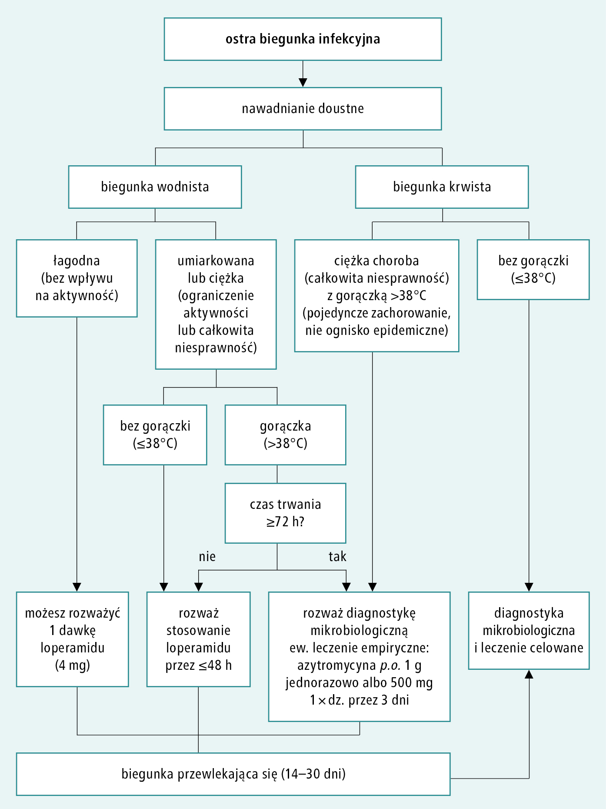

# 059 Postępowanie w ostrej biegunce

## Final

Przewlekła biegunka: [054 Diagnostyka różnicowa przewlekłych biegunek](./054%20Diagnostyka%20różnicowa%20przewlekłych%20biegunek.md)

https://www.mp.pl/interna/chapter/B16.I.1.2.

**Definicja:** 

1. Zbyt luźne stolce (płynne lub półpłynne; typu 6–7 według bristolskiej skali uformowania stolca)
2. ≥3/d lub >200 ml/d

**Mechanizmy:**

1. Upośledzenie wchłaniania w JC lub JG
   1. Uszkodzenie nabłonka / zmniejszenie pow. adsorpcyjnej
   2. Osmotyczna = w świetle są niewchłanialne osmolity
   3. Przyspieszona motoryka => przyspieszony pasaż
2. Sekrecyjna = zwiększone wydzielanie wody i elektrolitów do jelita z powodu aktywacji mech. transportowych enterocytów:
   1. enterotoksyny bakterii,
   - mediatory reakcji zapalnej (biegunka zapalna)
   - enterohormony

**Podział ze względu na czas:**

1. Ostra <= 14 dni
2. Przetrwała: 15-29 dni
3. Przewlekła: 30+dni

**Przyczyny:**

1. Ostra
   1. 90% bakterie lub ich toksyny
   2. DzN leków (najcz. nieinfekcyjna) B-blokery, dilitiazem, metformina, h. tarczycy, nadużywanie leków przeczyszczających (ich odstawienie zwykle powoduje ustąpienie biegunki w ciągu 24–48 h)
   3. Toksyny niebakteryjne: grzyby, arszenik, alkohol
   4. Alergia/nadwrażliwość pokarmowa
   5. ostre zapalenie uchyłków
   6. niedokrwienne zapalenie okrężnicy.
   7. Biegunka szpitalna to biegunka występująca w szpitalu lub do 3 dni po jego opuszczeniu. Przyczyna jest najczęściej niezakaźna:
      1. działania niepożądane leków,
      2. żywienie dojelitowe hiperosmotycznymi dietami płynnymi,
      3. zabiegi na przewodzie pokarmowym,
      4. reakcja na stres.
      5. Najczęstszą przyczyna zakaźną: Clostridioides difficile. Podejrzewa się to zakażenie u chorych przyjmujących antybiotyki, z gorączką, wymiotami i kurczowym bólem brzucha.

   8. Zatrucie pokarmowe to zespół ostrych objawów spowodowany spożyciem pokarmu skażonego bakteriami lub ich toksynami, a także pasożytami lub substancjami chemicznymi.
   9. Biegunka podróżnych to objawy zakażenia przewodu pokarmowego u osób podróżujących do krajów o niższym standardzie sanitarno-higienicznym, spożywających skażoną żywność lub wodę pitną.

**Postępowanie w ostrej biegunce infekcyjnej:**

zakładamy, że jest spowodowana zakażeniem przewodu pokarmowego
lub zatruciem pokarmowym i nie przeprowadzamy dalszej diagnostyki, chyba że:

1. stwierdzono charakterystyczne dla innych przyczyn objawy,
2. dane z wywiadu wskazują na przyczynę nieinfekcyjną (np. przyjmowane leki).

**Leczenie biegunki podróżnych:** gdy ciężki przebieg: azytromycyna 1 g p.o. jednorazowo lub 500 mg 1 × dz. przez 3 dni

**Powikłanie — odwodnienie:**

**Leczenie objawowe biegunki:**

1. Leczenie płynami obejmuje 2 fazy:
   1. uzupełnianie niedoborów (rehydratacja) – pierwsze 3–4 h, wyrównanie ubytku masy ciała;
   2. leczenie podtrzymujące – uzupełnianie bieżących strat, utrzymywane do czasu ustąpienia biegunki.
2. Leki przeciwbiegunkowe – loperamid, diosmektyd, oktreotyd.
3. Wyrównywanie innych zaburzeń (zwłaszcza w przebiegu ciężkiej biegunki):
   1. kwasicy metabolicznej,
   2. zaburzeń elektrolitowych: hipo- i hipernatremii, hipokaliemii, hipokalcemii, hipomagnezemii,
   3. niedożywienia,
   4. niedoborów witamin i pierwiastków śladowych.

## Brudnopis

