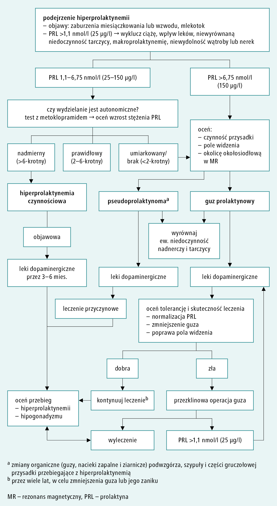

# 071 Objawy prolaktynoma

## Final

**Definicja:** Guz przysadki wydzielający prolaktynę. 

**Epidemiologia:** najczęstszy guz przysadki. Może być składnikiem zespołu MEN1. 

**Obraz kliniczny:**

1. Objawy hiperprolaktynemii
   1. U kobiet
      1. Trądzik
      2. Spadek libido
      3. Dyspareunia
      4. Hirsutyzm
      5. Zab. miesiączkowania
   2. U mężczyzn
      1. Ginekomastia
      2. Impotencja
      3. Spadek libido
      4. Niepłodność: oligospermia
2. Objawy ucisku na struktury
   1. Zaburzenia pola widzenia
3. Objawy wzrostu ICP:
   1. Ból głowy
4. Może być osteoporoza (estro)

**Diagnostyka:** 

1. Diagnostyka hiperprolaktynemii: lista wykluczeń (ciąża, stosunek, drażnienie brodawek, niedoczynność tarczycy, niewydolność wątroby, niewydolność nerek, makroprolaktynemia, leki), test z metoklopramidem (jeśli dodatni to rozpoznajemy hiperprolaktynemię czynnościową)
2. Diagnostyka guza: MR przysadki — zawsze przy hiperprolaktynemii należy go wykonać, nawet czynnościowej
3. Nie powinniśmy leczyć hiperprolaktynemii czynnościowej (na świecie nie ma dowodów), ale w PL się to robi.

**Leczenie:**

1. Farmakologiczne: agoniści dopaminowi: bromokryptyna, karbelogina. Powodują zmniejszanie guza.
2. Jeśli farmakoterapia nieskuteczna to resekcja przezklinowa guza.  

## Brudnopis