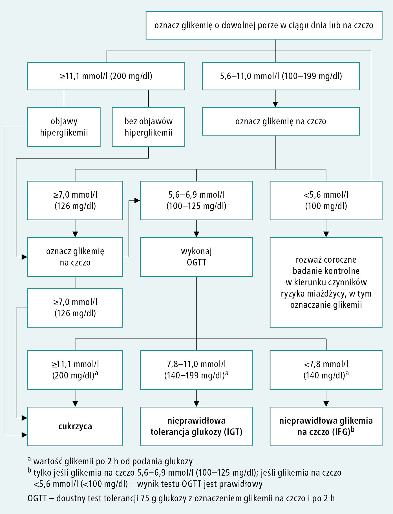

# 081 Algorytm rozpoznawania cukrzycy

## Final

**Rozpoznanie cukrzycy:**

1. Przygodna glikemia > 200mg/dl + objawy hiperglikemii
2. Przygodna glikemia >= 200mg/dl + (na czczo innego dnia >= 126mg/dl)
3. OGTT w 120 minucie testu >= 200mg/dl
4. Dwukrotnie (różne dni) glikemia na czczo > 126mg/dl
5. HbA1c > 6,5% (ale musi być tak bardzo zwalidowany pomiar, że nie ma jeszcze takiego w Polsce)

Stany przedcukrzycowe:

- IGT <= OGTT 140-199
- Jeśli na czczo <= 126 => OGTT i OGTT > 140

**P/w do diagnostyki cukrzycy:**

1. Ostra faza innej choroby
2. Bezpośrednio po urazie/zabiegu
3. W trakcie stosowania leków zwiększających glikemię (GKS, niektóre b-blokery, tiazydy)

**P/w do OGTT:** 

1. Już zdiagnozowana cukrzyca
2. Po resekcji żołądka
3. Świeży stan ostry (np świeży zawał)
4. Zespół upośledzonego wchłaniania

**Wskazania do OGTT:**

1. Profilaktycznie w 24-26tyg ciąży (są inne kryteria OGTT, grozi dużym dzieckiem)
2. IFG (tj glikemia na czczo 100-125mg/dl)
3. Wskazanie względne: prawidłowa glikemia na czczo ale podejrzenie cukrzycy

**Diagnostyka:**

1. Glikemia na czczo — 8-14h po ostatnim posiłku

**Badanie przesiewowe w kierunku cukrzycy:**

- Po 45rż raz na 3 lata
- Raz na rok w grupach ryzyka
  - BMI>25 (albo talia >94M, >80K)
  - Cukrzyca w rodzinie
  - Stan przedcukrzycowy (IFG, IGT)
  - Cukrzyca ciążowa w wywiadzie lub urodzono dziecko >4kg
  - Dysplipidemia, NT
  - PCOS
  - Mukowiscydoza od 10rż

**Rodzaje cukrzycy:** ...TODO

## Brudnopis

