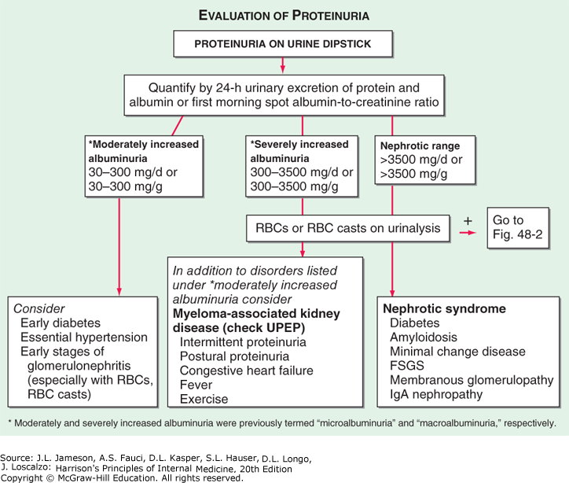

# 094 Diagnostyka różnicowa białkomoczu

## Final

**Białkomocz fizjologiczny:**

- Zdrowy człowiek traci na dobę z moczem <150 mg (średnio 50 mg) białka

**Przyczyny białkomoczu umiarkowanego:**

1. Wczesna cukrzycowa nefropatia
2. Nefropatia nadciśnieniowa
3. Wczesne stadia KZN

**Przyczyny białkomoczu ciężkiego nienerczycowego:**

1. Zespół nefrotyczny (opisany w [090 Objawy przewlekłych kłębuszkowych zapaleń nerek](./090%20Objawy%20przewlekłych%20kłębuszkowych%20zapaleń%20nerek.md))
2. Nowotwory hematologiczne, szczep. szpiczak
3. HFrEF
4. Gorączka
5. Ćwiczenia

**Zespół nerczycowy:**

1. 70% glomerulopatie pierwotne ([090 Objawy przewlekłych kłębuszkowych zapaleń nerek](./090%20Objawy%20przewlekłych%20kłębuszkowych%20zapaleń%20nerek.md)) = idiopatyczny zespół nerczycowy

   1. submikroskopowe KZN
   2. błoniaste KZN
   3. FSGS, 
   4. błoniastorozplemowe KZN
   5. rzadko mezangialne KZN (w tym nefropatia IgA), 
   6. GPKZN
   7. Choroba zmian minimalnych

2. Glomerulopatie wtórne (w przebiegu innych chorób)

   1. metaboliczne: cukrzyca, amyloidoza
   2. autoimmunologiczne
      1. nefropatia toczniowa
      2. układowe zap. naczyń
      3. Sjogren!
      4. Sarkoidoza
   3. Nowotworowe
      1. HL i NHL
      2. Białaczki limfatyczne
      3. Szpiczak plazmocytowy
      4. Guzy lite też: płuco, pierś, j. grube
   4. Polekowe
      1. NLPZ
      2. złoto
      3. penicylamina
      4. ołów, rtęć
      5. lit!
   5. Alergiczne: 
      1. jady błonkoskrzydłych i węży
      2. Szczepionki
      3. Antytoksyny — choroba posurowicza!
   6. Zakażenia
      1. Bakteryjne: IZW, gruźlica, trąd, kiła
      2. Wirusowe:HBV, HCV, HIV i EBV
      3. Pasożyty: malaria
   7. Zab. przepływu krwi przez nerki
      1. Zakrzepica żyły nerkowej
      2. NT3st = NT złośliwe
      3. NS, niedokrwistość sierpowatokrwinkowa
   8. Inne
      1. Stan przedrzucawkowy, rzucawka!
      2. Odrzucanie przeszczepu nerki
      3. Niedoczynność tarczycy

3. Glomerulopatie wrodzone

   1. Wrodzony zesp. nerczycowy
   2. Zespół Alporta
   3. ch. Fabry'ego

   b) choroby autoimmunologiczne – nefropatia toczniowa, układowe zapalenie naczyń, zespół Sjögrena, sarkoidoza

   c) nowotwory – chłoniak Hodgkina i chłoniaki nie-Hodgkina, białaczka limfatyczna, szpiczak plazmocytowy, guzy lite (płuca, sutka, jelita grubego, żołądka, nerki)

   d) reakcje na leki i substancje nefrotoksyczne – NSLPZ, złoto, penicylamina, heroina, ołów, rtęć, lit

   e) reakcje z nadwrażliwości – jady owadów błonkoskrzydłych i węży, szczepionki, antytoksyny (choroba posurowicza)

   f) zakażenia – bakteryjne (infekcyjne zapalenie wsierdzia, zakażenie połączenia komorowo-przedsionkowego, gruźlica, trąd, kiła), wirusowe (HBV, HCV, HIV, EBV), pasożytnicze (malaria, schistosomoza, filarioza)

   g) zaburzenia przepływu krwi przez nerki – zakrzepica żyły nerkowej, nadciśnienie złośliwe, niewydolność serca, niedokrwistość sierpowatokrwinkowa

   h) inne – stan przedrzucawkowy lub rzucawka, odrzucanie przeszczepu nerki, niedoczynność tarczycy

   3) glomerulopatie wrodzone – wrodzony zespół nerczycowy, zespół Alporta, choroba Fabry’ego.

**Białkomocz w PChN:** (jeśli mamy wcześniej rozpoznaną ch. nerek)

Harrison:

**Leczenie:**

1. leczenie przyczynowe
   1. W idiopatycznym (czyli w pierwotnym):
      1. Prednizon 2mg/kg
      2. 96% jest steroidowrażliwych i następi remisja w ciągu 4tyg
      3. Steroidooporny => zrobić biopsję i podać Cyklofosfamid, cyklosporynę, MFM
      4. Steroidozależność = 2 nawroty spowodowane zmniejszeniem dawki
2. leczenie objawowe (przede wszystkim zmniejszenie obrzęków)
   1. Najpierw tiazyd (wymaga wys. GFR)
   2. Można dołożyć antagonistę aldosteronu
   3. Jeśli nie można lub nieskuteczny => pętlowy
   4. Maksymalne leczenie:
      1. tiazyd => odczekać 1h => 100ml 20% albuminy + furosemid
3. leczenie spowalniające postęp PChN
   1. Dieta
      1. 3–6 g NaCl/d
      2. max białka do 0,8–1 g/kg + ilość tracona z moczem
      3. red. cholesterolu
   2. Zmniejszanie białkomoczu
      1. ACEI/ARB. Można skojarzyć ACEI+ARB w celu dalszej redukcji białkomoczu (ale więcej DzN, szczeg. przy niskim GFR)
      2. Antagoniści aldosteronu
   3. Usuwanie czynników ryzyka
4. leczenie powikłań takich jak zakrzepica.

## Brudnopis

