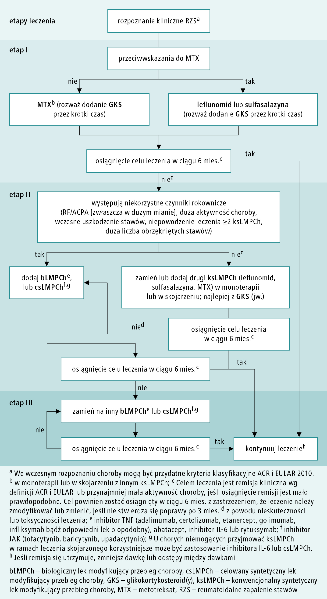

# 109 Algorytm terapeutyczny reumatoidalnego zapalenia stawów

## Final

**Definicja:** 

- Przewlekła choroba tkanki łącznej o podłożu immunologicznym i nieznanej etiologii
- w której występuje symetryczne zapalenie stawów
- prowadząca do inwalidztwa i przedwczesnej śmierci

**Epidemiologia:** 

- Kx3
- szczyt 40-50rż

**Przebieg:** 

- u 70% rzutowo-remisyjny
- Choroba progresuja w ciągu tygodni-miesięcy (a nie lat)
- Występują samoistne remisje

**Obraz kliniczny:** 

- Objawy charakterystyczne
  - Sztywność poranna ponad 1h
  - Symetryczny ból i obrzęk stawów
  - Ręka>stopa>inne (rzadko duże stawy)
  - Najczęściej: 1. międzypaliczkowe bliższe, 2. śródręczno-paliczkowe, 3. śródstopnfo-paliczkowe
- Objawy ogólne: stan podgorączkowy, ból mm., osłabienie, spadek mc, spadek łaknienia
- Zmiany stawowe wczesnego okresu
  - Ucieplenie + bolesność uciskowa, bez zaczerwienienia
- Wczesna ręka: Wrzecionowaty obrzęk stawów m-paliczkowych
- Pośrednia ręka: zanik mm. międzykostnych i glistowatych + rumień dłoniowy
- Późna ręka: ulnaryzacja, kciuk butonierkowaty, łabędzia szyja
- Zmiany pozastawowe
  - Guzki reumatyczne: podskórne niebolesne, przedramię, pośladki
  - U. krążenia (najczęstsza przyczyna zgonu): guzki zastawek, zap. osierdzia
  - Zespół Caplana (pylica reumatyczna)
  - Nerki: zmiany powodowane przez leki; śródmiąższowe zap. nerek
  - Neuropatie, pow. węzłów, zap. naczyń

**Rozpoznanie:** kryteria ACR i EULAR 2010

- Min 6pkt
- ...TODO:
- A. zajęcie stawów (dużo małych)
  - ...TODO
- B. Serologia (RF, ACPA)
  - ...TODO
- C. Laboratoryjne: OB, CRP
  - ...TODO
- D. Trwa co najmniej 6tyg (+1pkt)

**Leczenie:** 

- GKS dostawowo jeśli mało stawów
- NLPZ doraźnie
- U wszystkich: kw. foliowy 10mg/tydz
- LMPCh klasyczne: MTX 1 rzut
- LMPCh biologiczne
- TODO: algorytm

1. Leki modyfikujące przebieg choroby (LMPCh): mają podstawowe znaczenie w leczeniu RZS, gdyż zapobiegają zmianom destrukcyjnym w stawach lub opóźniają ich wystąpienie. Zastosuj je niezwłocznie po ustaleniu rozpoznania. LMPCh dzieli się na:
   1. syntetyczne (sLMPCh)
      1. konwencjonalne (ksLMPCh): metotreksat, leflunomid, sulfasalazyna, związki złota(i), hydroksychlorochina, chlorochina
      2. celowane (csLMPCh): tofacytynib (inhibitor kinaz janusowych JAK1, JAK2 i JAK3, w mniejszym stopniu TyK2), baricytynib (inhibitor JAK1 i JAK2), upadacytynib (inhibitor JAK1 i JAK3)
   2. biologiczne (bLMPCh)
      1. oryginalne (boLMPCh): antycytokinowe – adalimumab, anakinra, certolizumab, etanercept, golimumab, infliksymab, tocilizumab; nieantycytokinowe – abatacept, rytuksymab
      2. biopodobne (bpLMPCh), np. adalimumab, etanercept, infliksymab, rytuksymab.

2. NSLPZ p.o. stosuj wyłącznie w celu doraźnego opanowania podmiotowych i przedmiotowych objawów zapalenia. W razie przeciwwskazań lub nietolerancji zastosuj paracetamol i/lub słabe opioidy (np. tramadol).

3. GKS wstrzyknięcia dostawowe – rozważ, gdy choroba (lub jej zaostrzenie) zajmuje tylko jeden staw lub kilka stawów (wstrzyknięcia do tego samego stawu wykonuj nie częściej niż co 3 mies.); przed wstrzyknięciem wyklucz inne przyczyny zaostrzenia zmian stawowych, takie jak zakażenie lub zapalenie błony maziowej wywołane przez kryształy.

## Brudnopis

